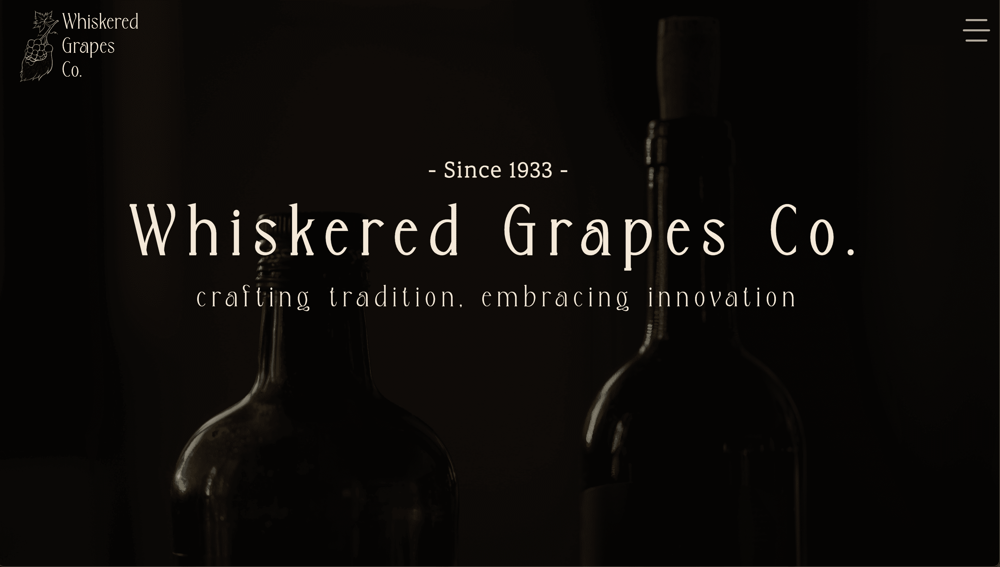

    

<h1 align='center'>
  Whiskered Grapes Co.
</h1>

  <a href='https://www.tagoperations.com/' target='_blank'>This website</a> serves as a virtual brochure for an imaginative wine company, offering a whimsical glimpse into a world where beards, oregano, and creativity converge in every bottle. I solely designed and developed this using <a href='https://react.dev/' target='_blank'>React.</a> See demo below.

    Whiskered Grapes Co. is not your typical winery; it's an eccentric celebration of the unconventional. The Pepperoni family's journey from Italy to Massachusetts has infused tradition with a dash of quirkiness. With beards, oregano, and a deep respect for the land, they have crafted wines that embrace both heritage and playful innovation. Each bottle tells the story of the Pepperoni family's legacy, where every sip is a delightful adventure, and tradition meets the unexpected. Welcome to a world where the art of winemaking is as unique as the beards that tend the vines.

    

# Tech Stack

**Client:**

- [React](https://react.dev/)
- [SwiperJs](https://swiperjs.com/)
- [react-awesome-reveal](https://react-awesome-reveal.morello.dev/)
- [body-scroll-lock](https://www.npmjs.com/package/body-scroll-lock)
- [react-icons](https://react-icons.github.io/react-icons/)

**Server:**

- [Node](https://nodejs.org/en)
- [Express](https://expressjs.com/)

**Database:**

- [MongoDB](https://www.mongodb.com/)
- [Mongoose](https://mongoosejs.com/)

**Deployment:**

- [Heroku](https://whiskered-grapes-co-9786d5309a36.herokuapp.com/)

# Features

- **Engaging Design:** The website's design seamlessly embodies the brand's distinctive personality.
- **Responsive Design:** Enjoy a visually pleasing experience on various screen sizes, thanks to the responsive design.
- **Modular Component Use:** The website utilizes modular components for easy reusability, consistency, and rapid customization.
- **Landing Page:** The website's inviting landing page engages potential customers effectively.
- **Story Page:** Explore the website's dedicated Story page to gain insight into Whiskered Grapes Co.'s history and unique aspects.
- **Wine Catalog:** Browse a user-friendly wine catalog to discover wines that match your preferences conveniently.
- **Detailed Wine View:** Individual wine pages offer comprehensive information, including flavor profiles and pairings.
- **Wine Tourism:** Find information on vineyard tours, and tastings.

# Demo

Please note: Video quality may be reduced due to Giphy hosting. 

# Color Reference

| Color        | Hex                                                              |
| ------------ | ---------------------------------------------------------------- |
| White       |  #fffcf7 |
| Beige |  #f4e9d9 |
| Beige 2   |  #b8a992 |
| Brown   |  #5a4c3f |
| Brown 2 |  #483e37 |
| Black        |  #0a0807 |

# Roadmap

- Polish responsive design styling.
- A contact page.
- A page that showcases the vineyard.
